Parts Implemented by Hatice Ozdemir
===================================
In here, there are some details about usage of Models & Brands part of project site to teach user features of tables and help how to use the functions when changing tables.

Tables
------
Detailed information will be given about tables in next subsections. These information are like columns of the table, what are they stands for and other things.

Brands
,,,,,,
Columns of the Brands table;

* **ID:** Shows IDs' of brands. Automatically given by developer.
* **Name:** Shows name of the brand. It is in text format.
* **Country:** Shows the country that the brand is founded at. It is in text format.
* **Foundation Year:** Shows the year of the brands are founded in. It must be a number.
* **#Constructor Championship:** Shows the number of winning the competition World Constructors' Champions. It must be a number.

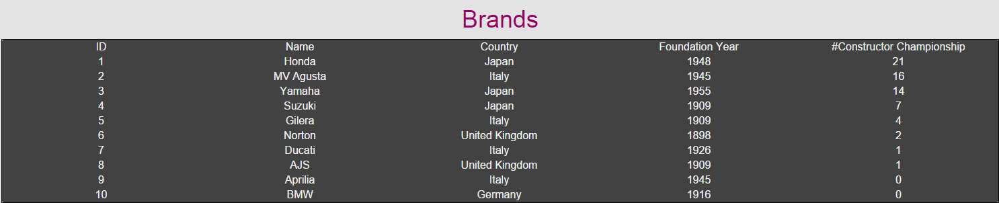

      An example table of Brands from site

Models
,,,,,,
Columns of the Models table;

* **ID:** Shows IDs' of models. Automatically given by developer.
* **Name:** Shows name of the model. It is in text format.
* **Rider:** Shows name of the well known riders that uses that bike mostly. It is in text format.
* **Constructor:** Shows name of the brand that construct model of bike. It is in text format.

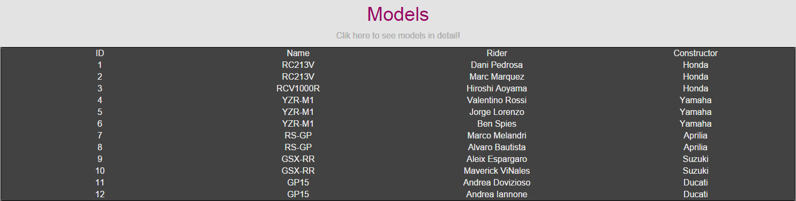

      An example table of Models from site

Specifications
,,,,,,,,,,,,,,
Columns of the Specifications table;

* **ID:** Shows IDs' of specifications for that model. Automatically given by developer.
* **Model:** Shows name of the model. It is in text format.
* **Engine Type:** Shows the type of the engine (2 stroke,4 stroke...). It is in text format.
* **Fuel Capacity:** Shows the fuel capacity of the model. It must be a number and it is in Liter.
* **Maximum Power:** Shows the maximum power of the model can reach. It must be a number and it is in kilowatt.
* **Maximum Speed:** Shows the maximum speed of the model can reach. It must be a number and it is in kilometer per hour.
* **Weight:** Shows the weight of the model. It must be a number and it is in kilogram

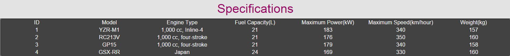

      An example table of Specifications (models in detail) from site

Operations
----------
Each table has same operations. So in this part there will be examples of functions only from Brands table. Detailed explanation of functions are in Developer Guide.

Add
,,,
This function adds new rows to the table with Name, Country, Foundation Year and #Constructor Championship variables in necessary formats.

   Fill boxes and click 'Add Brand' button

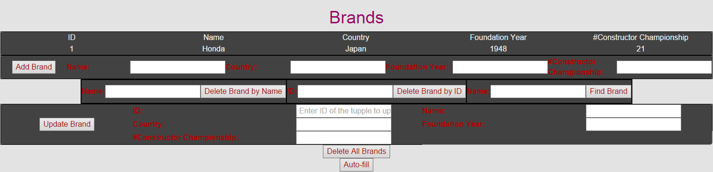

   Add operation successfully works

Delete
,,,,,,
This function deletes rows from table with Name or ID variables in necessary formats.

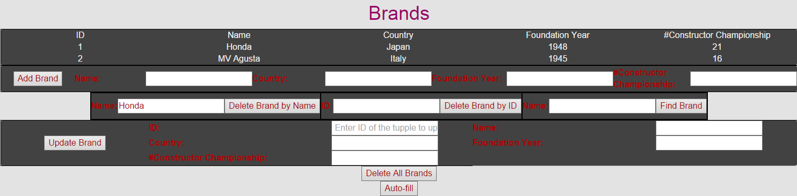

   Fill Name box and click 'Delete Brand by Name' button to delete rows by their names

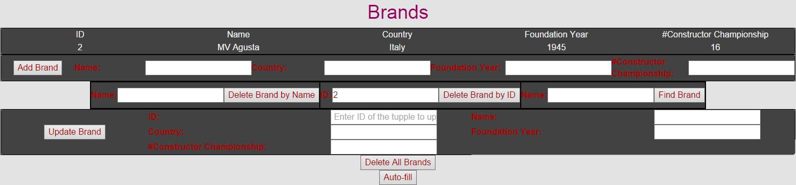

   Delete by name operation successfully works, fill ID box and click 'Delete Brand by ID' button to delete rows by their IDs

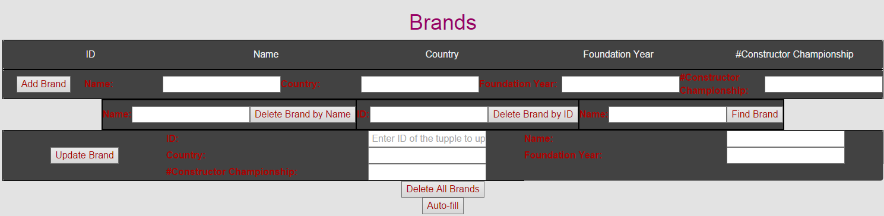

   Delete by ID operation successfully works

Update
,,,,,,
This function updates rows of the table which is selected by user with its ID. User must enter all of
the columns even if he/she wants to change only one feature. So update variables are ID, Name, Country, Foundation Year and #Constructor Championship
in necessary formats.

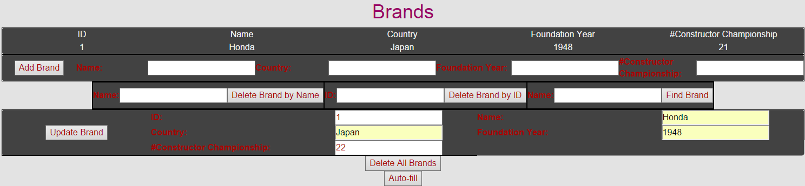

   Fill boxes and click 'Update Brand' button to update rows

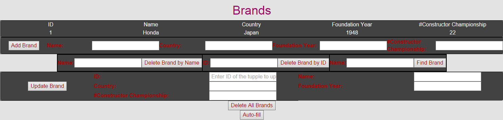

   Update operation successfully works

Search
,,,,,,
This function searches brands by name. So its variable is Name. It is independent and case sensitive. For example, if someone is trying to search 'li', function returns
both 'Ali' and 'Veli'.

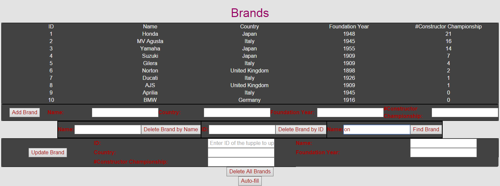

   Fill Name box and click 'Find Brand' button to search rows

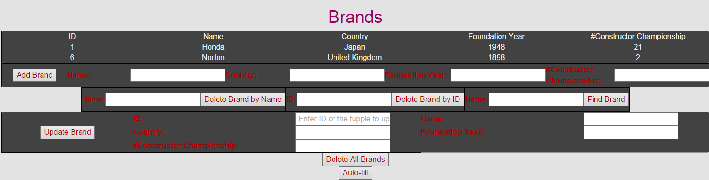

   Search operation successfully works

Delete All
,,,,,,,,,,
This function deletes all rows of table.

   Click 'Delete All Brands' button to delete all rows

   Delete all operation successfully works

Auto-fill
,,,,,,,,,
This function automatically fills rows of the table with predetermined, real values.

   Click 'Auto-fill' button to delete all rows

   Auto-fill operation successfully works
