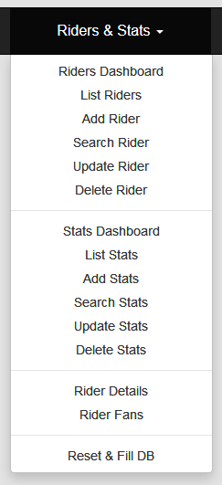
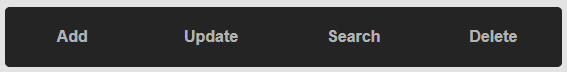
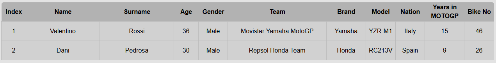
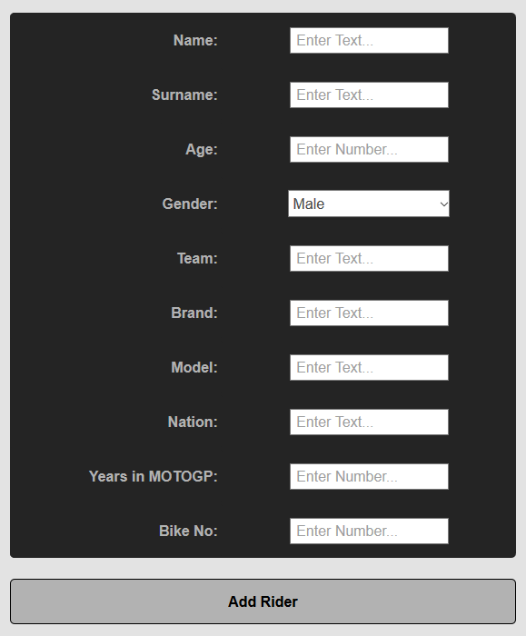
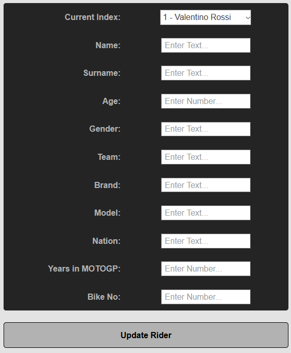
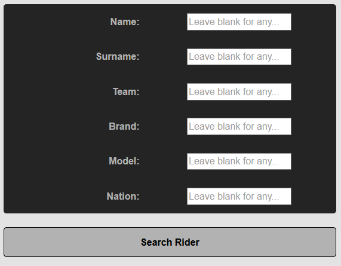
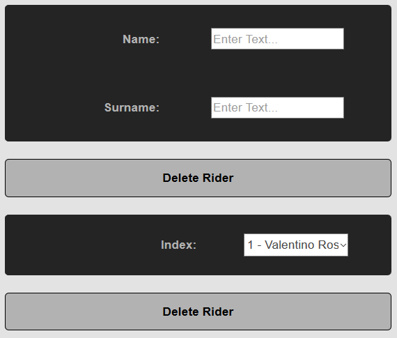

Parts Implemented by Nuri Mertcan Guner
=======================================
In this project HTML pages are also the user interface that we are providing and for the parts that are
explained in this documentation I tried to make them simple but effective for the user to understand and
use. All the pages I have implemented can be found under the same navigation element named as
**Riders & Stats**. There are few dashboard pages which includes every operation possible for the
corresponding table. Also there are some single operation pages too, but these pages also include
html table for the corresponding table in order to provide consistent and easily accessible contents.

Navigation element **Riders & Stats**:

Riders
------
Pages related to Riders table are Dashboard, Add, Update, Search and Delete pages. The dashboard page includes
the table itself and all operations possible while other pages include table and the operation the
the page name is related to.

In dashboard user can choose which operation they want to do from the upper selection part seen as:

Riders Table
^^^^^^^^^^^^
This is the interface of the Riders table that user can use to observe any element existent.

Add Rider
^^^^^^^^^
This is the interface for adding a rider to the table. Text and Number fields are filled with hints to
the user for easy usage. Also the *Gender* field is created as a dropdown menu allowing user to easily choose
from predefined selections. After all the fields are filled with corresponding information **Add Rider**
button below the form will send request to add a new rider and will return to same page.

Update Rider
^^^^^^^^^^^^
This is the interface for updating any existent rider in the table. Text and Number fields are filled with hints to
the user for easy usage. Current Index field is created as a dropdown menu to help user to choose existent rider
easily. This field also displayes the Name and Surnames of the rider related to choosen Index. This index is
consistent for a rider but other field in the form can be changed by this update method.To complete update
operation there is a button to send update request as **Update Rider**.

Search Rider
^^^^^^^^^^^^
This is the interface for searching existent riders in the table. There are *Name*, *Surname*, *Team*, *Brand*,
*Model* and *Nation* fields which are all required to have a Text input. User can also fill these fields with incomplete
text inputs (like filling half of the name of the rider). Also user is not required to fill every
field thanks to the flexibility function of the service. Any field can be left blank for any element to be displayed
by that field. Thus, leaving all fields blank would result in every element in table to be displayed, just as default.
To complete search operation there is a button to send search request as **Search Rider**.

Delete Rider
^^^^^^^^^^^^
This is the interface for deleting existent riders from the table. This operation has two different forms. First form requires
user to fill full name and full surname for desired rider to complete operation. And second form requires riders Index
to complete the delete operation. This index field also has a dropdown menu for easy usage for the user. These two forms have
different buttons to send request which are below them as **Delete Rider**.

