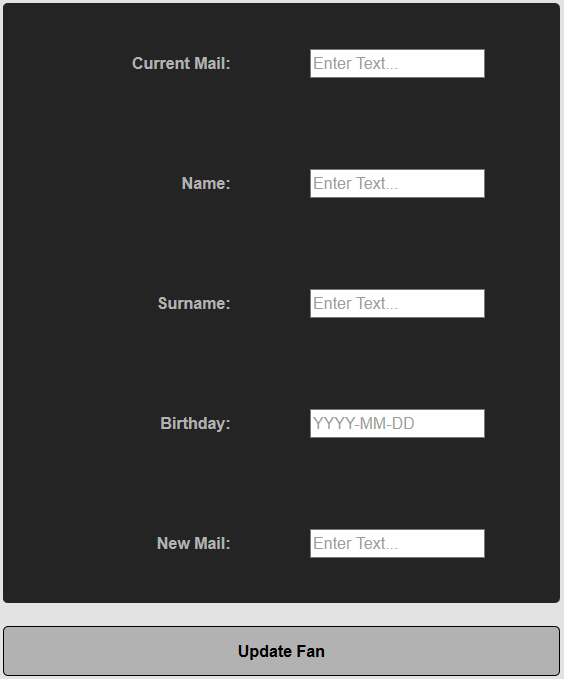

Parts Implemented by Nuri Mertcan Guner
=======================================
In this project HTML pages are also the user interface that we are providing and for the parts that are
explained in this documentation I tried to make them simple but effective for the user to understand and
use. All the pages I have implemented can be found under the same navigation element named as
**Riders & Stats**. There are few dashboard pages which includes every operation possible for the
corresponding table. Also there are some single operation pages too, but these pages also include
html table for the corresponding table in order to provide consistent and easily accessible contents.

Navigation element **Riders & Stats**:

.. image:: images/riders_stats_navigation.png
   :scale: 50%
   :alt: Can not load image.

Riders
------
Pages related to Riders table are Dashboard, Add, Update, Search and Delete pages. The dashboard page includes
the table itself and all operations possible while other pages include table and the operation the
the page name is related to.

In dashboard user can choose which operation they want to do from the upper selection part seen as:

.. image:: images/riders_dashboard.png
   :scale: 50%
   :alt: Can not load image.

Riders Table
^^^^^^^^^^^^
This is the interface of the Riders table that user can use to observe any element existent.

.. image:: images/riders_table.png
   :scale: 50%
   :alt: Can not load image.

Add Rider
^^^^^^^^^
This is the interface for adding a rider to the table. Text and Number fields are filled with hints to
the user for easy usage. Also the *Gender* field is created as a dropdown menu allowing user to easily choose
from predefined selections. After all the fields are filled with corresponding information **Add Rider**
button below the form will send request to add a new rider and will return to same page.

.. image:: images/riders_add.png
   :scale: 50%
   :alt: Can not load image.

Update Rider
^^^^^^^^^^^^
This is the interface for updating any existent rider in the table. Text and Number fields are filled with hints to
the user for easy usage. *Current Index* field is created as a dropdown menu to help user to choose existent rider
easily. This field also displayes the Name and Surnames of the rider related to choosen Index. This index is
consistent for a rider but other field in the form can be changed by this update method.To complete update
operation there is a button to send update request as **Update Rider**.

Search Rider
^^^^^^^^^^^^
This is the interface for searching existent riders in the table. There are *Name*, *Surname*, *Team*, *Brand*,
*Model* and *Nation* fields which are all required to have a Text input. User can also fill these fields with incomplete
text inputs (like filling half of the name of the rider). Also user is not required to fill every
field thanks to the flexibility function of the service. Any field can be left blank for any element to be displayed
by that field. Thus, leaving all fields blank would result in every element in table to be displayed, just as default.
To complete search operation there is a button to send search request as **Search Rider**.

.. image:: images/riders_search.png
   :scale: 50%
   :alt: Can not load image.

Delete Rider
^^^^^^^^^^^^
This is the interface for deleting existent riders from the table. This operation has two different forms. First form requires
user to fill full *Name* and full *Surname* for desired rider to complete operation. And second form requires *Riders Index*
to complete the delete operation. This index field also has a dropdown menu for easy usage for the user. These two forms have
different buttons to send request which are below them as **Delete Rider**.

Rider Stats
-----------
Pages related to Stats table are Dashboard, Add, Update, Search and Delete pages. The dashboard page includes
the table itself and all operations possible while other pages include table and the operation the
the page name is related to.

In dashboard user can choose which operation they want to do from the upper selection part seen as:

Stats Table
^^^^^^^^^^^
This is the interface of the Stats table that user can use to observe any element existent.

.. image:: images/stats_table.png
   :scale: 50%
   :alt: Can not load image.

Add Stats
^^^^^^^^^
This is the interface for adding a rider stats to the table. Number fields are filled with hints to
the user for easy usage. Also the *Rider Index* field is created as a dropdown menu allowing user to easily choose
from existent riders from the previously explained Riders Table. After all the fields are filled
with corresponding information **Add Stats** button below the form will send request to add a new
rider stats and will return to same page.

Update Stats
^^^^^^^^^^^^
This is the interface for updating any existent rider stats in the table. Number fields are filled with hints to
the user for easy usage. Also the *Rider Index* field is created as a dropdown menu allowing user to easily choose
from existent riders from the previously explained Riders Table. To complete update
operation there is a button to send update request as **Update Rider**.

Search Stats
^^^^^^^^^^^^
This is the interface for searching existent rider stats in the table. There are *Year* and
*Position* fields in one form with flexible functionality which means any of the fields can be left blank
and if every field is blank the result would be every element in the table. The second form requires *Rider Index*
field which would show stats of the selected rider as a result.To complete search operation there
are two buttons corredponding to different forms to send search request as **Search Stats**.

Delete Stats
^^^^^^^^^^^^
This is the interface for deleting existent rider stats from the table. This operation has two different forms. First form requires
user to select *Rider Index* from dopdown menu to complete operation.This form can be used to delete multiple
stats of the desired rider at the same time. And second form requires *Stat Index*
to complete the delete operation.  These two forms have
different buttons to send request which are below them as **Delete Stats**.

Rider Details
-------------
There is only one page related to Rider Details page and it may be considered as a dashboard page. The dashboard page includes
the table itself and all operations possible while other pages include table and the operation the
the page name is related to.

In dashboard user can choose which operation they want to do from the upper selection part seen as:

Rider Details Table
^^^^^^^^^^^^^^^^^^^
This is the interface of the Riders table that user can use to observe any element existent. Links in *Website*,
*Facebook*, *Twitter* and *Instagram* field can be used to directly go to their corresponding webpages.

Add Detail
^^^^^^^^^^
This is the interface for adding a rider details to the table. Text, Date and Number fields are filled with hints to
the user for easy usage. Also the *Rider Index* field is created as a dropdown menu allowing user to easily choose
from existent riders from the previously explained Riders Table. After all the fields are filled
with corresponding information **Add Details** button below the form will send request to add a new
rider details and will return to same page.

Update Detail
^^^^^^^^^^^^^
This is the interface for updating any existent rider detail in the table. Text, Date, Link and Number fields are filled with hints to
the user for easy usage. *Current Rider Index* field is created as a dropdown menu to help user to choose existent rider
easily. This field also displays the Twitter username of the rider related to choosen index. This index is
consistent for a rider detail but other field in the form can be changed by this update method.To complete update
operation there is a button to send update request as **Update Detail**.

Search Detail
^^^^^^^^^^^^^
This is the interface for searching existent rider details in the table. There are *Rider Index* field(with Name and Surname) as dropdown menu
for easy usage and this operation can be used to list desired riders detail on the same page without any other details.
To complete search operation there is a button to send search request as **Search Rider**.

Delete Detail
^^^^^^^^^^^^^
This is the interface for deleting existent rider details from the table. This operation has two different forms. First form requires
user to fill full *Rider Index* dropdown menu with Twitter username to delete desired rider detail to complete operation.
And second form requires *Info Index* to complete the delete operation.  These two forms have
different buttons to send request which are below them as **Delete Detail**.

Rider Fans
----------
There is only one page related to Rider Fans page and it may be considered as a dashboard page. The dashboard page includes
the table itself and all operations possible while other pages include table and the operation the
the page name is related to.

In dashboard user can choose which operation they want to do from the upper selection part seen as:

Rider Fans Table
^^^^^^^^^^^^^^^^
This is the interface of the Riders table that user can use to observe any element existent.

Become A Fan
^^^^^^^^^^^^
This is the interface for adding a fans to the table. This can be accessed from *Rider Details* page, clicking the
**Become A Fan** field for desired rider. Text, Date and Mail fields are filled with hints to
the user for easy usage. Also the *Detail Index* field is created as a dropdown menu allowing user to easily choose
from existent rider detail from the previously explained Rider Details Table. After all the fields are filled
with corresponding information **Become A Fan** button below the form will send request to add a new
fan and will return to same page.

Update Fan
^^^^^^^^^^
This is the interface for updating any existent fan in the table. Text, Date and Mail fields are filled with hints to
the user for easy usage.There are two different update alternatives for this table. First alternative has the
*Current Fan Index* field which is created as a dropdown menu to help user to choose existent rider fan
easily. This field also displays *Name*, *Surname* and *Detail Index* of the fan related to choosen index. This index is
consistent for a fan but other field in the form can be changed by this update method. Second alternative
works related to *Current Mail* field which is used to choose which elements to be updated from table. Also
allows user to change the mail address too.
To complete update operation there is a button to send update request as **Update Fan**.

Search Fan
^^^^^^^^^^
This is the interface for searching existent fans in the table. There are *Name*, *Surname*, *Mail Address* and *Detail Index*
fields as dropdown menu for easy usage and this operation can be used to list desired rider fans on the same page without any other fans.
Also user can leave any field blank for any element for the related field. All left blank would result in every fans available.
To complete search operation there is a button to send search request as **Search Fan**.

Delete Fan
^^^^^^^^^^
This is the interface for deleting existent riders from the table. This operation has two different forms. First form requires
user to fill full *Mail Address* of fan to delete desired fans to complete operation. This can be used to delete multiple fan elements.
And second form requires *Fan Index* to complete the delete operation. This deletes only one row of fan element. These two forms have
different buttons to send request which are below them as **Delete Fan**.

Reset $ Fill DB
---------------
This link in the dropdown manu of navigation bar sends a request to empty tables in this document, then recreate them with the
predefined default entries.
